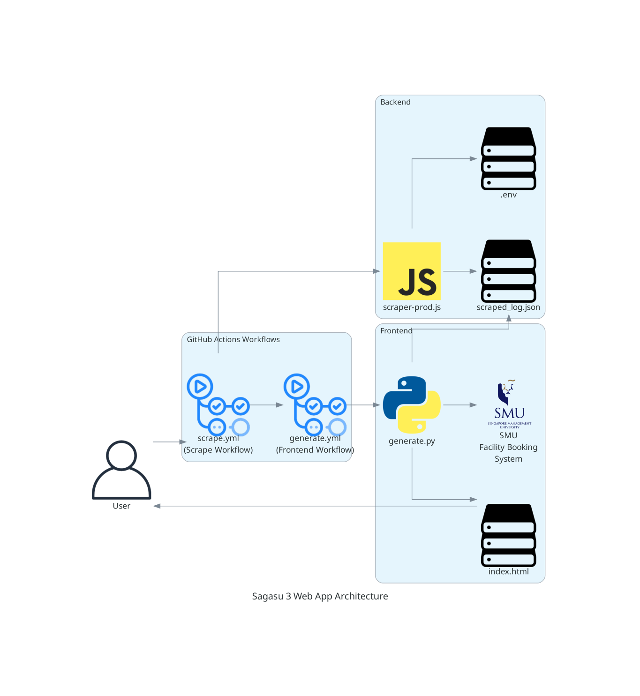

## To do

* update the generate.py to do the following
    * keep everything that's already there
    * just modify each room display so that each room can also be collapsed and when clicking the triangle dropdown it expands
    * then add a simple script that checks the current date and time and will show available to be booked next to each room in the collapsed display
* add relevant github secrets
* test out github workflow
* deploy frontend/index.html to github static sites 
* furnish this README.md as required

[](https://github.com/gongahkia/sagasu-3/releases/tag/1.0.0)

# `Sagasu 3`

<p align="center">
    
</p>

`Sagasu 3` is provided as 

## Rationale

...

## Stack

* *Frontend*: [HTML](https://developer.mozilla.org/en-US/docs/Web/HTML), [CSS](https://developer.mozilla.org/en-US/docs/Web/CSS), [JavaScript](https://developer.mozilla.org/en-US/docs/Web/JavaScript), [Github Pages Site](https://docs.github.com/en/pages/getting-started-with-github-pages/creating-a-github-pages-site)
* *Backend*: [Playwright](https://github.com/microsoft/playwright), [Github Actions](https://docs.github.com/en/actions), [Node.js](https://nodejs.org/en)
* *Script*: [JavaScript](https://developer.mozilla.org/en-US/docs/Web/JavaScript), [Python](https://www.python.org/)
* *Package*: [Docker](https://www.docker.com/)

## Architecture



## Usage

The easiest way to access `Sagasu 3` is via the Web App [here]().

The below instructions are for locally hosting and running `Sagasu 3`'s scraper.

1. First execute the below.

```console
$ git clone https://github.com/gongahkia/sagasu-3 
```

2. Then create a `.env` file at [backend](./backend/).

```env
SMU_EMAIL=XXX
SMU_PASSWORD=XXX
```

3. Run the `.env` population [script](./lib/cli.py).

```console
$ python3 -m venv myenv && source myenv/bin/activate && pip install -r lib/requirements.txt
$ python3 lib/cli.py
```

4. Finally run the below.

```
$ npx playwright install
$ cd backend && npm i && node scraper-dev.js
```

## Other notes

Also see the following.

* [Sagasu](https://github.com/gongahkia/sagasu)
* [Sagasu 2](https://github.com/gongahkia/sagasu-2)
