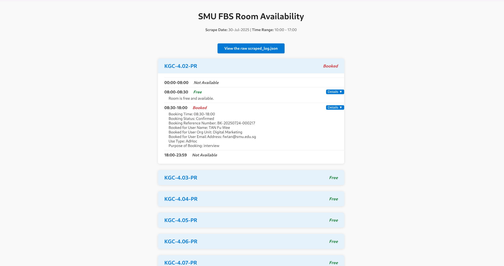
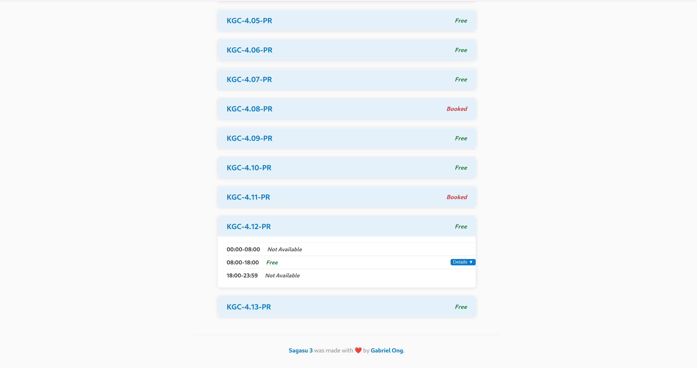

[](https://github.com/gongahkia/sagasu-3/releases/tag/1.0.0)


> [!WARNING]  
> [`Sagasu 3`](https://github.com/gongahkia/sagasu-3)'s Github Pages deployment is inactive as of 22 August 2025.  

# `Sagasu 3`

<p align="center">
    
</p>

`Sagasu 3` is served as a [Web App](./.github/workflows/generate.yml), with a [scheduled scraper](./.github/workflows/scrape.yml) that runs daily at varied times per [this configuration](#configuration).

Access the ***Live Web App*** [here](#usage).

## Stack

* *Frontend*: [HTML](https://developer.mozilla.org/en-US/docs/Web/HTML), [CSS](https://developer.mozilla.org/en-US/docs/Web/CSS), [JavaScript](https://developer.mozilla.org/en-US/docs/Web/JavaScript), [Github Pages Site](https://docs.github.com/en/pages/getting-started-with-github-pages/creating-a-github-pages-site)
* *Backend*: [Playwright](https://github.com/microsoft/playwright), [Node.js](https://nodejs.org/en), [Github Actions](https://docs.github.com/en/actions), [Cron](https://www.ibm.com/docs/en/db2/11.5.x?topic=task-unix-cron-format)
* *Script*: [JavaScript](https://developer.mozilla.org/en-US/docs/Web/JavaScript), [Python](https://www.python.org/)

## Rationale

Enough has already been said. If you must know why `Sagasu 3` exists, see [here](https://github.com/gongahkia/sagasu#rationale) or [here](https://github.com/gongahkia/sagasu-2#rationale).

<div align="center">
    
</div>


## Architecture


## Screenshot

<div align="center">
    
    
</div>

## Usage

The easiest way to access `Sagasu 3` is via the ***Live Web App*** at [gabrielongzm.com/sagasu-3](https://gabrielongzm.com/sagasu-3/).

The below instructions are for locally hosting and running `Sagasu 3`'s scraper.

1. First execute the below.

```console
$ git clone https://github.com/gongahkia/sagasu-3 
```

2. Then create a `.env` file at [backend](./backend/).

```env
SMU_EMAIL=XXX
SMU_PASSWORD=XXX
```

3. Run the `.env` population [script](./lib/cli.py) to specify the scraping configuration.

```console
$ python3 -m venv myenv && source myenv/bin/activate && pip install -r lib/requirements.txt
$ python3 lib/cli.py
```

4. Finally run the below.

```
$ npx playwright install
$ cd backend && npm i && node scraper-dev.js
```

## Configuration

### Scraper schedule

All these timeslots are in [SGT](https://www.timeanddate.com/time/zones/sgt) *([UTC+8](https://www.timeanddate.com/worldclock/timezone/utc8))* scheduled with [Cron](https://www.ibm.com/docs/en/db2/11.5.x?topic=task-unix-cron-format).

* Monday 9am, 3pm
* Tuesday 9am, 12pm
* Wednesday 12pm
* Thursday 9am, 12pm, 3pm
* Friday 9am, 3pm

### Room scraping configuration

```env
SCRAPE_DATE=<current_day>
SCRAPE_START_TIME='10:00'
SCRAPE_END_TIME='17:00'
SCRAPE_ROOM_CAPACITY='From6To10Pax'
SCRAPE_BUILDING_NAMES='Yong Pung How School of Law/Kwa Geok Choo Law Library'
SCRAPE_FLOOR_NAMES='Level 4,Level 5'
SCRAPE_FACILITY_TYPES='Project Room'
SCRAPE_EQUIPMENT='TV Panel'
```

## Other notes

`Sagasu 3` rose from the ashes of the below now archived projects.

* [Sagasu](https://github.com/gongahkia/sagasu)
* [Sagasu 2](https://github.com/gongahkia/sagasu-2)
